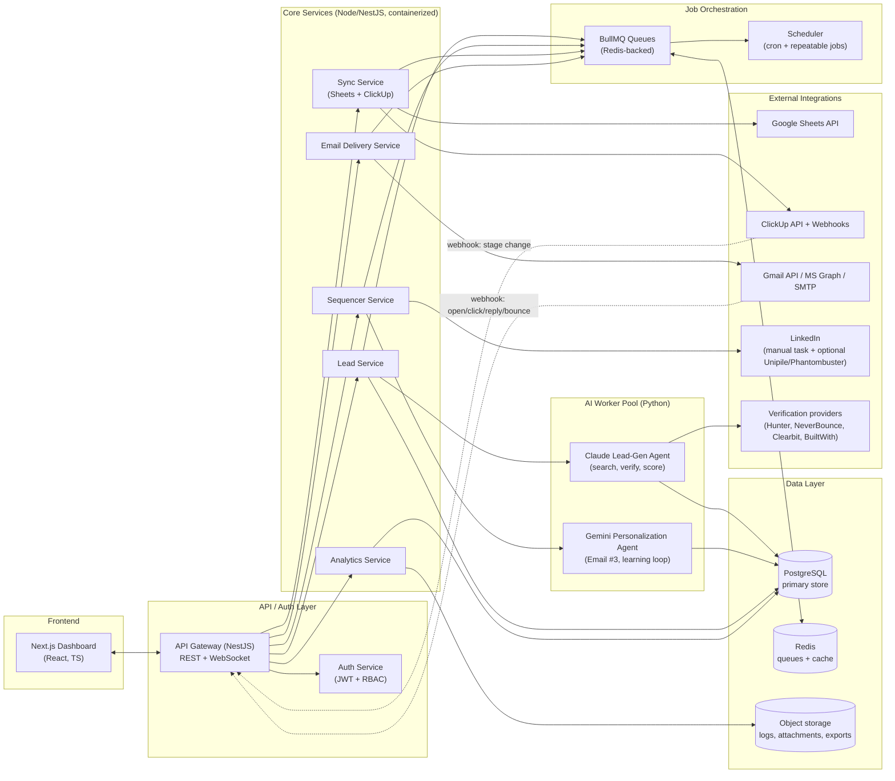
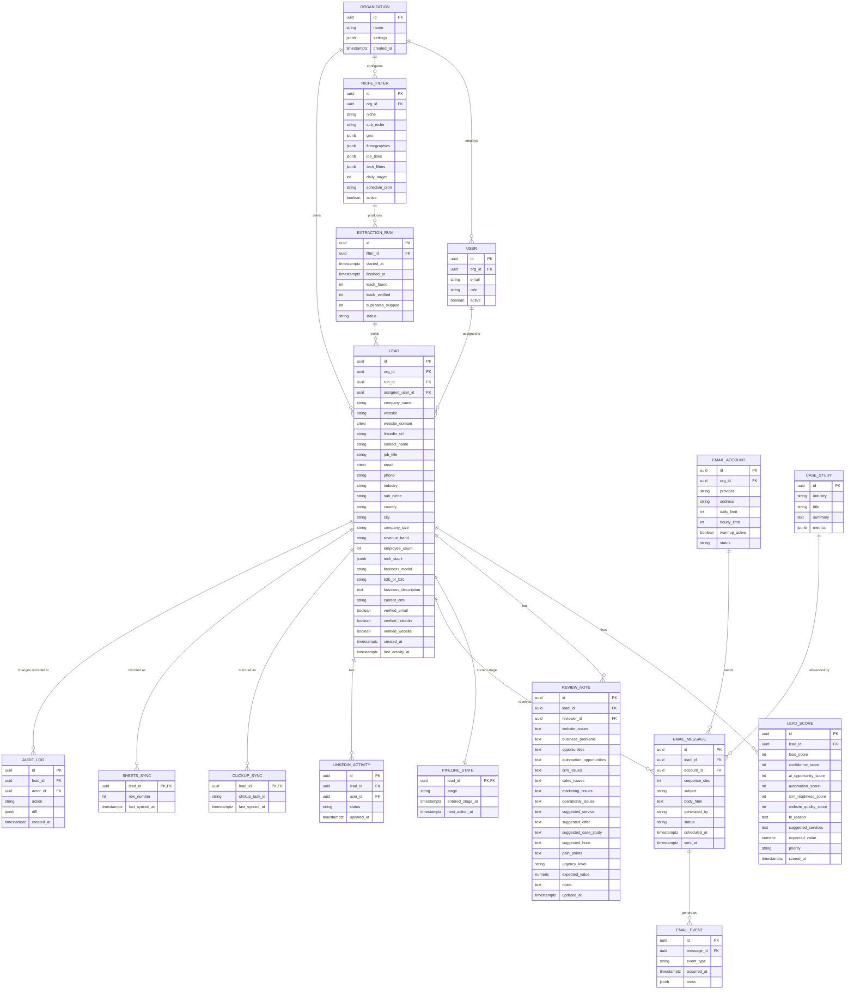
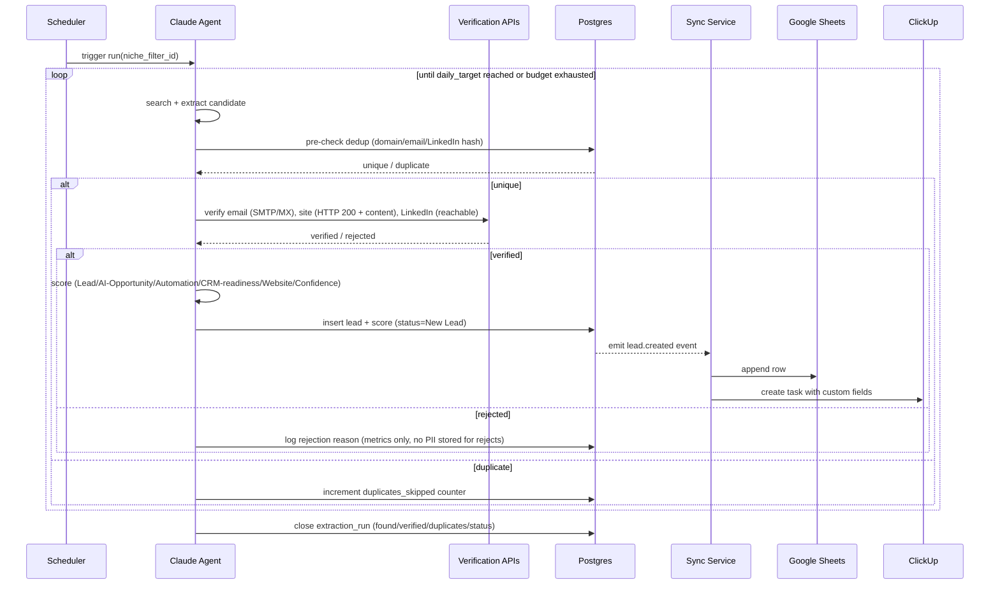
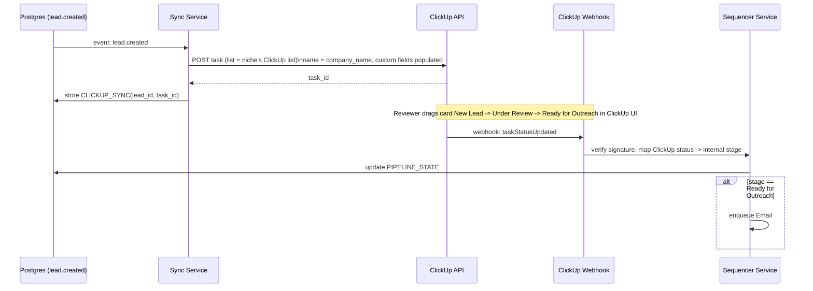
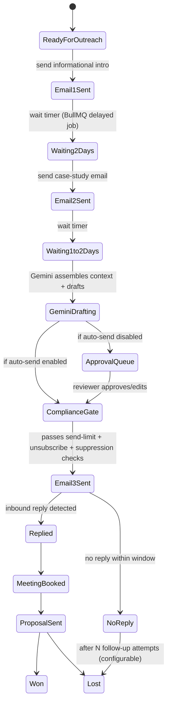

# AI-Powered Lead Generation & Client Acquisition Platform
### Complete System Architecture & Product Requirements Document

**Codename:** Pipeline &nbsp;|&nbsp; **Version:** 1.1 (design + reference implementation in progress) &nbsp;|&nbsp; **Date:** 2026-07-27
**Prepared for:** Internal use — single-tenant MVP, multi-tenant-ready architecture

> **Status:** a scaffold implementing this design now exists in this working directory (monorepo: `apps/web`, `apps/api`, `apps/ai-workers`, `packages/types`). See **Part J** for what's actually built, what's stubbed, and the handful of places the real implementation deviated from this design. The README.md at the repo root tracks day-to-day setup/build status; this document stays the source of truth for intent and rationale.

---

## How to read this document

This PRD covers all 44 requested deliverables plus a critical architectural review. It's organized into 10 parts so you can jump to what you need instead of reading linearly:

- **Part A — Product Foundation:** objective, user flow, roles, PRD summary
- **Part B — Architecture:** system architecture, tech stack, AI agent design, data model
- **Part C — Core Workflows:** lead generation, verification, dedup, Sheets/ClickUp sync, email sequencing, LinkedIn
- **Part D — AI & Prompting:** Claude/Gemini responsibilities, prompt architecture, prompt library
- **Part E — Platform Engineering:** APIs, folder structure, auth, queues, scheduler, error handling
- **Part F — Dashboard:** UI/UX, wireframes, field definitions
- **Part G — Non-Functional:** security, scalability, deployment, cost, testing, monitoring, backup
- **Part H — Delivery Plan:** roadmap, milestones, risks
- **Part I — Critical Review:** bottlenecks, compliance (GDPR/CAN-SPAM), and required changes before launch
- **Part J — Implementation Status:** what's built in the reference scaffold, what's stubbed, and deviations from this design

---

# PART A — PRODUCT FOUNDATION

## A1. Primary Objective (recap)

You configure niche, filters, and schedule once. The system then runs a closed loop — **generate → verify → dedupe → store → sync → sequence → track → learn** — with human involvement limited to two checkpoints: **reviewing/annotating a lead** and **approving the AI-drafted Email #3 / high-risk sends**. Everything else — extraction, scoring, Sheet writes, ClickUp cards, wait-timers, Email #1/#2 sends, tracking, and dashboard rollups — runs unattended.

## A2. Product Requirement Document (PRD) — Summary

| | |
|---|---|
| **Problem** | Manual prospecting (search → verify → enrich → personalize → sequence → track) takes 3–5 hours/day per 20–30 leads and doesn't scale past one operator. |
| **Solution** | An internal SaaS-style platform where a Claude-driven agent sources and scores ≥100 verified leads/day per active niche, a deterministic backend guarantees zero duplicates and syncs to Sheets + ClickUp, and a scheduled sequencer runs a 3-email + LinkedIn cadence, with Gemini writing the final, fully personalized pitch from human review notes. |
| **Users** | Admin (you), Manager, Lead Reviewer, Sales Rep / Business Developer, Viewer. Single organization at MVP; architecture supports multi-tenant later. |
| **Success metrics** | ≥100 verified leads/day/niche; <2% duplicate leak rate; ≥95% lead-field completeness; email deliverability ≥95% inbox placement; reply rate benchmarked against cold-email industry baseline (1–5%) and improved over time via the feedback loop (Part D4). |
| **Out of scope (v1)** | Full LinkedIn send automation (policy risk — see Part I), multi-CRM sync beyond ClickUp, self-serve external customers. Both are designed for but gated behind feature flags. |
| **Non-goals** | This is not a public lead-marketplace or data-reseller product — sourced data is for this business's own outbound use, which affects the legal basis used in Part I. |

## A3. User Flow (you, day-to-day)

```mermaid
flowchart TD
    A[Log into Dashboard] --> B{Anything to review?}
    B -- Yes --> C[Open lead card: verify AI fields,\nfill Human Review fields\nWebsite Issues, Pain Points, Suggested Offer...]
    C --> D[Move card: Under Review -> Ready for Outreach]
    B -- No --> E[Check Analytics tab]
    D --> F[System takes over: Email 1 -> wait -> Email 2 -> wait -> Gemini drafts Email 3]
    F --> G{Email 3 requires approval?\n(toggle in Settings)}
    G -- Yes --> H[Approve/edit/reject draft in Approvals queue]
    G -- No, auto-send enabled --> I[Auto-sent after policy checks]
    H --> I
    I --> J[Replies + LinkedIn activity tracked automatically]
    J --> K[Dashboard updates: KPIs, funnel, revenue pipeline]
    E --> A
```

## A4. User Roles & Permissions

| Role | Leads | Filters/Schedule | Review fields | Approve Email 3 | Email account config | ClickUp/Sheets config | Users & billing |
|---|---|---|---|---|---|---|---|
| **Admin** | Full CRUD | Full | Full | Yes | Full | Full | Full |
| **Manager** | Full CRUD | Edit | Full | Yes | View only | View only | Invite only |
| **Lead Reviewer** | Read + annotate | Read | Full (their assigned) | No | No access | No access | No |
| **Sales Rep / BD** | Read own pipeline | Read | Read + notes | Suggest (not final) | No access | No access | No |
| **Viewer** | Read-only, no PII export | Read | Read | No | No access | No access | No |

Enforced server-side via RBAC middleware (Part E4) — never trust client-side role checks. PII fields (email, phone) are redacted for Viewer at the API layer, not just hidden in the UI.

---

# PART B — ARCHITECTURE

## B1. Complete System Architecture



**Why this shape:** the Claude/Gemini agents are isolated in their own worker pool because AI calls are slow, rate-limited, and cost-metered — they must never sit inline with a request/response HTTP path. Everything long-running (lead search loops, wait-timers, email sequencing, sync retries) is a **queued job**, not a synchronous call, so a stalled AI provider or a ClickUp outage degrades gracefully instead of taking the dashboard down.

## B2. Technology Stack

| Layer | Choice | Why |
|---|---|---|
| Frontend | Next.js 14 (App Router) + TypeScript + Tailwind + shadcn/ui + Recharts | SSR for a data-heavy dashboard, strong typing shared with backend via a common types package |
| Backend (core) | NestJS (Node.js/TypeScript) | Structured modules map cleanly to Lead/Sequencer/Sync/Email/Analytics services; first-class DI, guards for RBAC, easy WebSocket gateway for live notifications |
| AI workers | Python (FastAPI for control endpoints + worker processes) | Claude Agent SDK and Google GenAI SDK are most mature in Python; keeps prompt/tool logic out of the request-serving backend |
| Primary DB | PostgreSQL 16 | Relational integrity for leads/pipeline/audit trail; JSONB for flexible AI-scored fields; `pg_trgm`/`citext` for fuzzy dedup |
| Cache / Queue | Redis 7 + BullMQ | Battle-tested job queue with delays (native fit for "wait 2 days"), retries, rate limiting, repeatable/cron jobs |
| Object storage | S3-compatible (AWS S3 / Cloudflare R2) | Email HTML snapshots, exported CSVs, log archives |
| Search/dedupe assist | pgvector extension | Embedding-based fuzzy company/name matching to catch near-duplicates exact-match misses |
| Auth | Auth.js/NextAuth (MVP) → Auth0/WorkOS (multi-tenant) | JWT + refresh tokens, RBAC claims, SSO-ready upgrade path |
| Email sending | Gmail API + Microsoft Graph API + SMTP relay, abstracted behind an internal Email Provider interface | Multi-account rotation without vendor lock-in; add Postmark/SES as a transactional fallback |
| Lead sourcing/verification | Claude with tool-use (web search/browse via MCP) + Hunter.io/Apollo/Clearbit/NeverBounce/BuiltWith APIs | Claude orchestrates; specialized providers verify email/tech-stack/firmographic data so "verified" has a real source, not just an LLM guess |
| Personalization | Gemini 2.x (large context window) | Ingests full lead record + reviewer notes + website content in one call for Email #3 |
| Automation/integration bus | n8n (self-hosted) as an optional secondary orchestrator | Lets non-engineers wire new integrations (Slack, CRMs) without backend deploys — core logic stays in NestJS/BullMQ, n8n is for the long tail |
| Containers/orchestration | Docker; Docker Compose (MVP) → Kubernetes (scale phase) | Same images promote from local to prod |
| IaC | Terraform | Reproducible environments, drift detection |
| Observability | OpenTelemetry → Grafana + Loki + Prometheus; Sentry for exceptions | Single pane across services and AI workers |
| CI/CD | GitHub Actions | Lint/test/build/scan → deploy on merge to `main` with manual prod gate |

## B3. AI Agent Architecture

Two distinct agents, deliberately not merged, because they have different jobs, different cadences, and different failure modes:

```mermaid
flowchart TB
    subgraph ClaudeAgent["Claude Lead-Gen Agent (runs on schedule)"]
        C1[Planner: read active filters] --> C2[Search tools: web search,\ncompany DB APIs, site fetch]
        C2 --> C3[Extractor: structured lead JSON]
        C3 --> C4[Verifier: cross-check email/site/LinkedIn\nvia 3rd-party APIs]
        C4 --> C5[Scorer: Lead Score, AI Opportunity Score,\nAutomation Score, Confidence Score]
        C5 --> C6[Dedup pre-check against Postgres]
        C6 --> C7{Meets quality bar\nand not duplicate?}
        C7 -- No --> C2
        C7 -- Yes --> C8[Emit verified lead -> Lead Service]
    end

    subgraph GeminiAgent["Gemini Personalization Agent (event-triggered)"]
        G1[Trigger: lead reaches\n'Waiting after Email 2'] --> G2[Context assembly:\nfirmographics + tech stack\n+ reviewer notes + website scrape\n+ case study library]
        G2 --> G3[Draft Email 3: problems,\nROI, roadmap, CTA]
        G3 --> G4[Self-critique pass:\ntone, factual grounding,\nno hallucinated claims]
        G4 --> G5{Auto-send enabled\nfor this workspace?}
        G5 -- No --> G6[Push to Approval Queue]
        G5 -- Yes --> G7[Compliance gate:\nunsubscribe link, sender ID,\nsend-limit check]
        G6 --> G7
        G7 --> G8[Hand to Email Delivery Service]
    end
```



**Agent design principles:**
- **Claude runs a bounded loop, not an unbounded one.** "Continuously search until the required number is reached" is implemented as a capped iteration budget (e.g., max 40 search/verify cycles or 20 minutes per run) that yields partial results and logs a shortfall rather than looping forever against a thin market — an empty niche should surface as a dashboard warning, not a silent infinite job.
- **Verification is never LLM-only.** Claude proposes candidates; a deterministic verification step (SMTP/MX check via NeverBounce, LinkedIn URL pattern + reachability check, WHOIS/site-liveness check) confirms them. This is what makes "Verified Email" a defensible claim instead of a hallucination risk.
- **Gemini never sends directly.** It always writes to a draft record; the compliance gate and (optionally) a human are always between "drafted" and "sent."

## B4. Database Design (ERD)



`website_domain` and `email` use Postgres `citext` (case-insensitive) with unique constraints scoped to `org_id` — this is the backbone of exact-match dedup (Part C2). `pgvector` embeddings on `company_name + domain` catch fuzzy near-duplicates the unique constraint can't (e.g., "Acme Inc." vs "Acme, Inc").

---

# PART C — CORE WORKFLOWS

## C1. Lead Generation Flow (detailed)



**Continuous search until target reached, safely:** the loop tracks three counters — `attempts`, `verified`, `duplicates` — and stops on whichever comes first: `verified == daily_target`, `attempts == max_attempts`, or `elapsed == max_runtime`. A run that stops short of target still closes cleanly and surfaces "78/100 verified — niche may be saturated, consider widening filters" on the dashboard, instead of retrying indefinitely and burning API budget.

## C2. Duplicate Detection Logic

Two-tier check, cheapest first:

1. **Tier 1 — exact match (pre-verification, in-loop, <5ms):** normalized-domain, normalized-email, LinkedIn-slug, and company-name-slug each hashed and checked against a Postgres unique index scoped to the org. Any hit → skip immediately, before spending a verification API call.
2. **Tier 2 — fuzzy match (post-extraction, before insert):** `pg_trgm` trigram similarity on company name (threshold 0.85) + `pgvector` cosine similarity on a `company_name + address + domain-root` embedding (threshold 0.92). Catches "Acme Inc" vs "Acme Incorporated" vs a re-scraped listing with a typo. A fuzzy hit doesn't auto-skip — it's flagged `possible_duplicate=true` and routed to the reviewer's queue rather than silently dropped, since fuzzy matching has false positives and a wrongly-skipped real company is a lost lead.

Rejected duplicates are counted (`duplicates_skipped`) for the dashboard's Duplicate Rate KPI but the candidate payload itself is discarded, not retained, to minimize unnecessary PII storage (Part I, GDPR data-minimization).

## C3. Lead Verification Logic

| Field | Verification method | Failure handling |
|---|---|---|
| Email | SMTP handshake / MX validation via NeverBounce or ZeroBounce; reject `catch-all`/`unknown` results below confidence threshold | Lead held in `Pending Verification`, retried once after 24h, then discarded if still unverifiable |
| Website | HTTP HEAD/GET returns 2xx, has a recognizable business (title/meta present), not parked-domain markers | Marked `verified_website=false`; lead can still qualify if email+LinkedIn verified, but Website Quality Score = 0 |
| LinkedIn | Company/person URL resolves and slug matches extracted name (fuzzy ≥0.8) | Unverifiable → LinkedIn outreach step is skipped for that lead, flagged on the card |
| Contact person / job title | Cross-referenced from LinkedIn profile + company site staff page when available | If only one source confirms, `confidence_score` is reduced rather than the lead rejected |
| Technology stack | BuiltWith/Wappalyzer-style API lookup on the domain | Optional field — absence doesn't block qualification |

A lead only reaches `New Lead` (visible on the dashboard) once it clears the **minimum verification bar**: verified email AND (verified website OR verified LinkedIn) AND confirmed company name. Everything below that bar is dropped, not stored — this keeps the qualified-lead table's average Confidence Score meaningful.

## C4. Google Sheets Integration Flow

- Service-account auth (domain-wide delegation if the Sheet lives in a Workspace you own) via Google Sheets API v4.
- One **spreadsheet per organization**, one **tab per active niche filter**, header row generated from the field list in Part F5.
- Writes are **append-only** from the platform's perspective — Sheets is a read/export surface and audit backup, not a place edits flow back from, to avoid a two-way-sync conflict-resolution problem. (If you want the Sheet to accept manual edits later, that's a v2 feature requiring a conflict policy — flagged in Part H4 roadmap, not built into v1.)
- Batched writes (Sheets API quota is 300 write requests/min/project) — the Sync Service batches up to 500 rows per `values.append` call and queues writes via BullMQ with exponential backoff on 429s.
- A `SHEETS_SYNC` row tracks `row_number` so later status updates (email sent, stage change) can be written back to the correct row via `values.update` on a range, not a full rewrite.

## C5. ClickUp Automation Flow



- ClickUp webhooks (`taskStatusUpdated`, `taskUpdated`) are the trigger for stage-driven automation — **ClickUp is the human-facing control surface**, Postgres is the source of truth, and the webhook is what keeps them consistent. Every webhook payload is HMAC-verified and idempotency-keyed (ClickUp can deliver duplicates) before being applied.
- Reverse direction (system-driven changes like "Email 1 Sent") are written back to ClickUp via API so the card always reflects real pipeline state even though a human never touched it.
- One **ClickUp List per niche/pipeline**, one **Space per organization** — this is what "multiple ClickUp workspaces" in Future Scalability maps onto: the org↔workspace mapping is a config row, not a hardcoded ID.

## C6. Email Automation Flow (full sequence)



- **Wait timers are BullMQ delayed jobs**, not a polling cron — a job is enqueued at Email #1 send-time with a 2-day delay; if the lead replies or is marked "Lost" before the delay elapses, the job is cancelled via its job ID stored on the lead. This is what makes "wait exactly 2 days" precise instead of "checked once a day and off by up to 24h."
- **Reply detection** short-circuits the sequence at every step: inbound-email webhook (Gmail push notification / Graph subscription) checks the `In-Reply-To`/thread ID against open sequences and immediately halts further scheduled sends for that lead, moving it to `Replied`.
- **Suppression list** (unsubscribes, hard bounces, spam complaints, manual do-not-contact) is checked before every single send, not just at sequence start — required for CAN-SPAM/GDPR compliance (Part I).

## C7. LinkedIn Outreach Flow

v1 is **task-based, not automated**, by deliberate choice (see Part I for why full automation is a policy risk):

1. When Email #1 sends, a ClickUp subtask "LinkedIn: connect + message {contact_name}" is auto-created and assigned to the lead's owner, with the suggested hook pre-filled from the Gemini/reviewer notes.
2. The assigned user manually sends the connection request and message from their own LinkedIn account.
3. Status (`Connection Sent` / `Accepted` / `Message Sent` / `Replied` / `Meeting Scheduled`) is updated either manually via a one-click status widget in the dashboard, or — for orgs that accept the added policy risk — semi-automated via **Unipile** (a LinkedIn-ToS-conscious inbox API used by many sales-engagement tools), gated behind an explicit `linkedin_automation_enabled` org setting, hard rate-limited (≤20-25 connection requests/day/seat, matching LinkedIn's own soft limits), and off by default.
4. Both paths feed the same `LINKEDIN_ACTIVITY` table, so the dashboard's LinkedIn Performance panel doesn't care which mode produced the data.

---

# PART D — AI & PROMPTING

## D1. Claude Agent Responsibilities

- Own the **niche filter → candidate search → extraction → verification orchestration → scoring** pipeline (Part B3, C1).
- Compute the five scores per lead: Lead Score, Confidence Score, AI Opportunity Score, Automation Score, CRM Readiness — each backed by an explicit rubric (Part D3) so scores are explainable, not a black-box number.
- Generate Email #1 and Email #2 from templates + light personalization (company name, industry, one fact from the verified business description) — these are **informational, low-personalization** by design, so they don't need the full Gemini context-assembly pipeline.
- Never write directly to Sheets/ClickUp/Email providers — always through the Lead Service / Sync Service / Email Service APIs, so every external write is auditable and rate-limited in one place regardless of which agent produced it.

## D2. Gemini Agent Responsibilities

- Triggered once per lead, at the "Waiting 1–2 days after Email 2" step.
- Assembles a single large-context prompt from: full `LEAD` row, `LEAD_SCORE`, `REVIEW_NOTE` (all human-filled fields), a live re-fetch of the company website's key pages, and the top 1-2 matching `CASE_STUDY` records (matched by industry/problem similarity via embeddings).
- Produces Email #3 body **and** a structured rationale object (`{problems_identified, automation_ideas, roi_estimate_basis, roadmap_steps}`) that's stored alongside the email — this rationale is what a reviewer checks during approval, and what feeds the learning loop (D4).
- Runs a mandatory **self-critique pass**: a second Gemini call checks the draft against a groundedness checklist (does every factual claim trace back to a field in the context? is the tone within policy? is there a working CTA and unsubscribe placeholder?) before the email reaches the approval queue or compliance gate.

## D3. AI Prompt Architecture

Layered prompts, not one mega-prompt, so each layer can be tuned/tested independently:

```
1. System/Role layer     — fixed per-agent identity, output-format contract (strict JSON schema), safety constraints
2. Org context layer     — org's services, tone-of-voice guide, brand facts (injected from Settings, not hardcoded)
3. Task layer            — the specific job: "score this lead" / "draft Email 3" / "verify this candidate"
4. Data layer            — the actual lead record / search results / website content (always the last, largest block)
5. Output contract layer — JSON schema + few-shot example of a correctly-formed response
```

All AI calls request **structured output** (JSON mode / schema-constrained) — free-text parsing of AI responses is a reliability anti-pattern and is avoided everywhere except the final email body field itself.

## D4. AI Prompt Library (representative prompts)

**Lead scoring prompt (Claude, abbreviated):**
```
SYSTEM: You are a B2B lead qualification analyst for {org.name}, which sells {org.services}.
Score the candidate strictly using the rubric below. Return ONLY valid JSON matching the schema.

RUBRIC:
- lead_score (0-100): fit against {org.icp_definition}
- ai_opportunity_score (0-100): evidence of manual/repetitive workflows in {candidate.business_description}
  that {org.services} could automate
- automation_score (0-100): presence of disconnected tools / manual data entry signals
- crm_readiness_score (0-100): current_crm field maturity (none=low, spreadsheet=low-mid, legacy CRM=mid, modern CRM=high)
- website_quality_score (0-100): from rendered site_snapshot
- confidence_score (0-100): based on how many fields were independently verified vs inferred

CANDIDATE: {candidate_json}
SITE_SNAPSHOT: {site_text_excerpt}

OUTPUT SCHEMA: {json_schema}
```

**Email #3 drafting prompt (Gemini, abbreviated):**
```
SYSTEM: You write one-time, fully bespoke outbound emails for {org.name}. Never use a template phrase.
Every claim must be traceable to the CONTEXT block. If a fact isn't in CONTEXT, do not assert it.

CONTEXT:
  company: {lead.company_name} ({lead.industry}, {lead.employee_count} employees, {lead.country})
  tech_stack: {lead.tech_stack}
  reviewer_notes: {review_note.*}   # website_issues, pain_points, suggested_offer, suggested_hook, urgency_level
  website_excerpt: {live_site_fetch}
  matched_case_study: {case_study.title} — {case_study.metrics}

TASK: Write Email 3. Structure: (1) one-line hook referencing a REAL specific detail from CONTEXT,
(2) name 1-2 concrete problems, (3) 2-3 automation ideas mapped to org.services, (4) a plausible ROI
framed as a range with the basis stated, (5) a 3-step roadmap, (6) a single low-friction CTA (15-min call).
Tone: {org.tone_of_voice}. Max 180 words. Include {{unsubscribe_link}} placeholder verbatim.

OUTPUT SCHEMA: { "subject": string, "body_html": string, "rationale": {...} }
```

**Self-critique / groundedness prompt (Gemini, abbreviated):**
```
SYSTEM: Audit the DRAFT against CONTEXT. Fail if: (a) any claim isn't supported by CONTEXT,
(b) tone is pushy/hard-sell, (c) missing unsubscribe placeholder, (d) subject line is clickbait/spammy
per CAN-SPAM header-honesty requirements. Return { "pass": bool, "issues": [...] }.
```

## D5. AI Improvement / Feedback Loop

```mermaid
flowchart LR
    A[Email opens/clicks/replies] --> D[Feedback Aggregator\n(weekly batch job)]
    B[Won/Lost outcomes] --> D
    C[Reviewer edits to Gemini drafts] --> D
    D --> E[Compute deltas: subject-line performance,\nhook types, CTA variants, send-time windows]
    E --> F[Update Org Prompt Config:\nfavored hooks/CTAs weighted up,\nunderperformers weighted down]
    F --> G[Suggestions surfaced to Admin\nfor approval before auto-applying]
    G --> D3[Prompt Architecture layer 2\n'Org context']
```

Reviewer edits to a Gemini draft are the single highest-signal feedback source — diffing the sent version against the draft (via a lightweight text-diff, not another LLM call) tells you exactly which phrasing/claims/CTAs humans consistently correct, and that becomes weighted examples fed back into the org context layer. Improvement suggestions are surfaced for admin approval, never silently auto-applied to live prompts — an unsupervised prompt-mutation loop is a correctness risk you don't want in a system that sends real emails to real prospects.

---

# PART E — PLATFORM ENGINEERING

## E1. API Architecture

REST + one WebSocket channel, versioned from day one (`/api/v1`):

- **Resource-oriented REST** for CRUD (leads, filters, users, case studies).
- **Command endpoints** for actions with side effects (`POST /leads/{id}/advance-stage`, `POST /leads/{id}/approve-email`) rather than overloading PATCH — makes audit logging and permission checks explicit per action.
- **WebSocket gateway** (`/ws`) pushes live notifications (new leads synced, approval needed, send failures) to the dashboard — this is what powers the "Live Notifications" panel without polling.
- **Webhook receivers** (`/webhooks/clickup`, `/webhooks/gmail`, `/webhooks/graph`) are a separate, unauthenticated-by-JWT but signature-verified surface, isolated behind their own rate limiter so a webhook storm can't starve normal API traffic.

## E2. API Endpoints (representative)

| Method | Path | Purpose |
|---|---|---|
| `POST` | `/api/v1/auth/login` | Credential login, returns JWT + refresh token |
| `GET` | `/api/v1/niche-filters` | List configured filters |
| `POST` | `/api/v1/niche-filters` | Create filter (industry, geo, firmographics, schedule) |
| `PATCH` | `/api/v1/niche-filters/{id}` | Edit filter — takes effect on next scheduled run |
| `POST` | `/api/v1/niche-filters/{id}/run-now` | Manual trigger, admin/manager only |
| `GET` | `/api/v1/leads` | List/filter/paginate leads |
| `GET` | `/api/v1/leads/{id}` | Full lead detail incl. scores, review notes, sequence history |
| `PATCH` | `/api/v1/leads/{id}/review` | Save reviewer's Human Review fields |
| `POST` | `/api/v1/leads/{id}/advance-stage` | Move pipeline stage (also invoked by ClickUp webhook mapping) |
| `GET` | `/api/v1/leads/{id}/emails` | Sequence history for a lead |
| `POST` | `/api/v1/leads/{id}/approve-email` | Approve/edit/reject a queued Email #3 draft |
| `GET` | `/api/v1/analytics/summary` | Dashboard KPI rollup (cached, 60s TTL) |
| `GET` | `/api/v1/analytics/funnel` | Pipeline-stage funnel counts |
| `GET`/`PATCH` | `/api/v1/settings/email-accounts` | Manage connected mailboxes, limits, warmup |
| `GET`/`PATCH` | `/api/v1/settings/sequence` | Wait durations, auto-send toggle, follow-up caps |
| `POST` | `/webhooks/clickup` | Signature-verified stage-change ingestion |
| `POST` | `/webhooks/gmail` \| `/webhooks/graph` | Delivery/open/click/reply/bounce ingestion |
| `GET` | `/api/v1/audit-log/{lead_id}` | Full change history for a lead |

## E3. Folder Structure

```
platform/
├── apps/
│   ├── web/                     # Next.js dashboard
│   │   ├── app/(dashboard)/...
│   │   ├── components/
│   │   └── lib/api-client.ts
│   ├── api/                     # NestJS core services
│   │   ├── src/modules/
│   │   │   ├── auth/
│   │   │   ├── leads/
│   │   │   ├── niche-filters/
│   │   │   ├── sequencer/
│   │   │   ├── sync/            # sheets + clickup adapters
│   │   │   ├── email/
│   │   │   ├── analytics/
│   │   │   └── webhooks/
│   │   └── src/common/          # guards, interceptors, RBAC decorators
│   └── ai-workers/              # Python
│       ├── claude_agent/
│       │   ├── planner.py
│       │   ├── search_tools.py
│       │   ├── verifier.py
│       │   └── scorer.py
│       ├── gemini_agent/
│       │   ├── context_builder.py
│       │   ├── drafting.py
│       │   └── critique.py
│       └── shared/prompts/      # versioned prompt templates
├── packages/
│   ├── types/                   # shared TS types (lead schema, DTOs)
│   └── config/                  # shared lint/tsconfig
├── infra/
│   ├── terraform/
│   └── docker/
├── docs/
└── .github/workflows/
```

## E4. Authentication & Permissions

- JWT access tokens (15 min) + rotating refresh tokens (7 days, revocable) via Auth.js; refresh tokens stored hashed.
- RBAC enforced via NestJS Guards reading a `role` claim, with resource-level checks (e.g., Sales Rep can only mutate leads where `assigned_user_id == self`) done in the service layer, not just route-level.
- PII field-level redaction: a response-serialization interceptor strips `email`/`phone` for the Viewer role server-side, so there's no client-side-only protection to bypass.
- Service-to-service auth (webhooks, AI workers → API) uses signed HMAC requests / mTLS internally, never shares the user JWT secret.
- Secrets (Gmail/ClickUp/Sheets/Claude/Gemini API keys) live in a secrets manager (AWS Secrets Manager / Doppler), never in env files committed to the repo, rotated on a schedule.

## E5. Queue Management

BullMQ queues, one per concern, each with its own concurrency and retry policy:

| Queue | Concurrency | Retry policy | Notes |
|---|---|---|---|
| `lead-extraction` | 2 (per niche, to respect API rate limits) | 3 attempts, exponential backoff | Long-running; heartbeats logged for observability |
| `lead-verification` | 10 | 3 attempts | Calls 3rd-party verification APIs |
| `sheets-sync` | 5 | 5 attempts, backoff tuned to Sheets 429s | Batched writes |
| `clickup-sync` | 5 | 5 attempts | Idempotent upserts keyed on `lead_id` |
| `email-send` | Matches sum of connected mailbox hourly limits | 3 attempts, then dead-letter | Rate-limited per `EMAIL_ACCOUNT`, not globally |
| `wait-timers` | N/A (delayed jobs) | N/A | Cancelable by job ID on reply/stage-change |
| `webhook-ingest` | 20 | 2 attempts | Fast, mostly DB writes |

Dead-letter queues are inspected on the dashboard's "Automation Health" panel — a job that exhausts retries becomes a visible incident, not a silent drop.

## E6. Scheduler Design

- **Cron-style repeatable BullMQ jobs** drive `lead-extraction` per niche filter, on the org's configured timezone and cadence (daily/weekly), computed server-side in UTC with timezone offset stored per filter.
- **Delayed jobs** (not cron) drive wait-timers — precise per-lead delays anchored to the actual send timestamp.
- A **scheduler supervisor** process reconciles on startup: any repeatable job missing from BullMQ (e.g., after a Redis flush) is re-registered from the `NICHE_FILTER` table, so schedule state is always derivable from Postgres, never only living in Redis.

## E7. Error Handling & Retry Logic

- Every external call (Claude, Gemini, verification APIs, Sheets, ClickUp, Gmail/Graph) goes through a shared **resilience wrapper**: timeout → retry with exponential backoff + jitter → circuit breaker (opens after N consecutive failures, half-opens after cool-down) → dead-letter with full context for manual replay.
- Errors are classified **transient** (network blip, 429, 5xx — retry) vs **permanent** (401, 404, malformed data — don't retry, surface immediately) so the retry logic doesn't waste cycles hammering a bad API key.
- All failures emit a structured log event `{service, job, error_class, lead_id?, org_id, trace_id}` correlated end-to-end via a `trace_id` propagated from the originating API request or scheduled job — this is what lets you answer "why didn't lead X get Email 2" in one query instead of grepping five services.

---

# PART F — DASHBOARD

## F1. Dashboard UI/UX (information architecture)

```
┌─ Overview ── Leads ── Pipeline (Kanban) ── Sequences ── Analytics ── Settings ─┐
│                                                                                  │
│  Overview:   KPI strip + funnel chart + live activity feed + automation health  │
│  Leads:      Filterable table, bulk actions, lead detail drawer                 │
│  Pipeline:   Kanban mirroring ClickUp stages (read-through, not a fork of truth)│
│  Sequences:  Approval queue for Email #3, mailbox health, send calendar        │
│  Analytics:  Email/LinkedIn funnels, cohort trends, revenue pipeline           │
│  Settings:   Niche filters, schedules, mailboxes, users/roles, case studies    │
└──────────────────────────────────────────────────────────────────────────────┘
```

Scanned, not read — the Overview screen leads with a KPI strip (numbers + trend sparkline + delta), not a wall of text, per standard operational-dashboard practice: summary before detail, state encoded as color/chips (e.g., a red chip on "System Errors" when >0), not just a number to parse.

## F2. Dashboard Wireframe — Overview (text layout)

```
──────────────────────────────────────────────────────────────────────────
 KPI STRIP
 [Today's Leads 112▲] [Verified 108] [Dup Rate 3.1%] [Avg Lead Score 71]
 [Pending Review 14]  [Meetings Booked 6] [Won 2] [System Errors 0]
──────────────────────────────────────────────────────────────────────────
 ┌ Funnel (this week) ─────────────┐ ┌ Automation Health ──────────────┐
 │ New→Review→Ready→E1→E2→E3→Reply │ │ Queues: ● all healthy           │
 │ [bar chart, stage-by-stage]     │ │ Sheets: ● | ClickUp: ● | Email: ●│
 │                                  │ │ Claude usage: 62% of daily cap  │
 └──────────────────────────────────┘ │ Gemini usage: 18%               │
 ┌ Email Performance ──────────────┐ └──────────────────────────────────┘
 │ Sent 340 | Open 61% | Reply 4.2%│ ┌ Upcoming Follow-ups ─────────────┐
 │ [line chart, 30-day trend]      │ │ 12 waiting on Email 2 (next 24h) │
 └──────────────────────────────────┘ │ 5 drafts awaiting approval       │
 ┌ Recent Activity (live feed) ────┐ └──────────────────────────────────┘
 │ 18:02 Lead synced: Acme Corp    │
 │ 18:01 Reply detected: Nimbus Co│
 │ 17:58 Email3 approved: Delta Inc│
 └──────────────────────────────────┘
──────────────────────────────────────────────────────────────────────────
```

## F3. Wireframe — Lead Detail Drawer

```
┌ Acme Corp ───────────────────────────────────────────── [Ready for Outreach ▾]
│ Website: acme.com ✓   LinkedIn: /company/acme ✓   Email: j.doe@acme.com ✓
│ Industry: SaaS · 51-200 employees · $5-10M rev · US, Austin
│ ── AI Scores ─────────────────────────────────────────────────────────
│ Lead 78  Confidence 84  AI-Opportunity 71  Automation 66  CRM-Ready 40  Site 55
│ Fit reason: "Manual onboarding across 3 disconnected tools; no CRM automation"
│ ── Human Review (editable) ────────────────────────────────────────────
│ Website Issues:      [........................................]
│ Business Problems:   [........................................]
│ Suggested Offer:     [........................................]
│ Urgency:  ○ Low ● Medium ○ High     Expected Value: [$______]
│ ── Sequence ───────────────────────────────────────────────────────────
│ ● Email 1 sent 07/24  ● Email 2 sent 07/26  ○ Email 3: drafted, pending approval
│ [ View Draft & Approve ]
└─────────────────────────────────────────────────────────────────────────
```

## F4. Lead Extraction Settings screen

Fields exposed per niche filter: Industry / Niche / Sub-niche, Country(ies), City(ies), Company Size range, Revenue band, Employee count range, Job titles (multi-select), Technology filters, Funding stage, Business model, B2B/B2C, Daily target count, Source priority order, Schedule (cron builder UI), Timezone, Active toggle. Editing any field takes effect on the **next scheduled run only** — in-flight runs finish under the filter version they started with, avoiding a half-old-half-new-criteria batch.

## F5. Google Sheets Column Definitions

`Lead ID, Company Name, Website, Website Verified, LinkedIn URL, LinkedIn Verified, Contact Name, Job Title, Email, Email Verified, Phone, Industry, Sub-Niche, Country, City, Company Size, Revenue Band, Employee Count, Tech Stack, Business Model, B2B/B2C, Business Description, Current CRM, Lead Score, Confidence Score, AI Opportunity Score, Automation Score, CRM Readiness Score, Website Quality Score, Fit Reason, Suggested Services, Expected Value, Priority, Pipeline Stage, Assigned User, Created Date, Last Activity, Next Follow-up, ClickUp Task URL`

## F6. ClickUp Custom Field Definitions

| Field | Type | Notes |
|---|---|---|
| Lead Name, Company, Website, Email, Phone, LinkedIn | Text/URL/Email | Synced, read-only in ClickUp (edit source is the platform) |
| Industry, Sub Niche, Country | Dropdown | Options generated from active niche filters |
| Company Size, Revenue, Employees | Number/Dropdown | |
| Decision Maker, Job Title | Text | |
| Technology Stack | Labels (multi-select) | |
| Current CRM, Current AI Usage | Dropdown | |
| Lead Score, Confidence Score, AI Opportunity Score, Website Score | Number (progress-bar rendering) | |
| Outreach Status, Email Status, LinkedIn Status | Dropdown | System-updated |
| Current Pipeline Stage | ClickUp native Status (drives the workflow, Part C5) | |
| Created Date, Last Activity, Next Follow-up | Date | |
| Assigned User | ClickUp native assignee | |
| Priority | ClickUp native priority | |
| **Human-editable:** Website Issues, Business Problems, Possible Opportunities, AI Opportunities, Automation Opportunities, CRM/Sales/Marketing/Operational Issues, Suggested Service/Offer/Case Study/Hook, Pain Points, Urgency Level, Expected Value, Notes | Long text / Dropdown | These are the only fields ClickUp is the source of truth for — synced *into* Postgres, not out |

---

# PART G — NON-FUNCTIONAL REQUIREMENTS

## G1. Security Best Practices

- Least-privilege service accounts for Sheets/ClickUp/Gmail — scoped OAuth scopes only (e.g., `gmail.send`, not full mailbox access).
- All PII encrypted at rest (Postgres TDE / column-level encryption for email+phone) and in transit (TLS everywhere, including internal service calls).
- Rate limiting + WAF on public endpoints; webhook endpoints verify provider signatures (ClickUp HMAC, Gmail/Graph pub/sub tokens) and reject replay via a nonce/timestamp window.
- Secrets in a managed vault, rotated quarterly or on personnel change; no long-lived personal Gmail passwords — OAuth2 app credentials only.
- Dependency and container image scanning in CI (Dependabot/Snyk, Trivy); SAST on PRs.
- Audit log (`AUDIT_LOG`) is append-only and covers every field change, every stage transition, and every AI-approved/rejected action — this is both a security control and the record you'd need in a data-subject access request.

## G2. Scalability Strategy

- Stateless core services behind a load balancer scale horizontally; the only scale-sensitive piece is the AI worker pool, which scales by queue depth (BullMQ concurrency + autoscaling worker replicas).
- Postgres scales vertically first, then read-replicas for analytics queries (the Analytics service reads from a replica, never the primary, so a dashboard refresh never contends with a lead insert).
- 10,000 leads/day is ~7/minute average, ~1/second at 3x peak burst — well within a single well-tuned Postgres primary; the actual bottleneck at that scale is **3rd-party API rate limits** (verification providers, Sheets, ClickUp, mailbox sending limits), which is why every integration is queued and rate-limited per-account rather than assumed infinite.
- Multi-tenant path: `org_id` is already on every table (Part B4); moving from single-tenant to multi-tenant is a matter of enforcing row-level security policies in Postgres and adding tenant-scoped API keys — not a schema rewrite.

## G3. Deployment Architecture

- MVP: Docker Compose on a single managed VM or Railway/Render, Postgres + Redis managed instances, S3-compatible storage.
- Scale phase: Kubernetes (EKS/GKE) with separate node pools for stateless API services vs. AI worker pool (different resource profiles — AI workers are I/O-bound waiting on model APIs, not CPU-bound).
- Blue/green or rolling deploys via GitHub Actions → registry → cluster; DB migrations run as a pre-deploy gated step, never auto-applied on pod start.
- Environments: `dev` → `staging` → `prod`, with staging using sandboxed/test ClickUp workspace, a test Google Sheet, and a mailbox allowlist that only sends to internal test addresses — this is what prevents a staging bug from emailing real prospects.

## G4. Cost Estimation (indicative, monthly, MVP scale — ~100-300 leads/day)

| Item | Est. cost/mo |
|---|---|
| Claude API (search/verify/score calls) | $250–600 |
| Gemini API (Email #3 + critique) | $80–200 |
| Verification providers (Hunter/NeverBounce/BuiltWith) | $150–400 |
| Compute (containers, MVP scale) | $150–300 |
| Postgres + Redis (managed) | $80–200 |
| Object storage | $10–30 |
| Email sending infra (mailboxes, warmup tooling) | $100–300 |
| Observability (Sentry/Grafana Cloud tier) | $50–100 |
| ClickUp / Google Workspace (assume already owned) | existing |
| **Total (MVP)** | **~$900–2,100/mo** |

At 10,000 leads/day, verification + AI cost line items scale roughly linearly (dominant cost driver), while compute/DB scale sub-linearly — expect the same categories at roughly 15-25x, mitigated by caching repeated site fetches and batching verification calls.

## G5. Testing Strategy

- **Unit:** scoring rubric logic, dedup matching functions, prompt-template rendering (pure functions, no live API calls).
- **Contract tests:** mocked ClickUp/Sheets/Gmail/Claude/Gemini responses against fixed schemas, so a provider API change is caught at the contract boundary.
- **Integration:** full lead lifecycle against sandboxed accounts (test ClickUp workspace, test Sheet, test mailbox) in CI on every PR to core services.
- **E2E:** Playwright suite covering the reviewer flow (open lead → fill review fields → advance stage → see Email 1 auto-send in staging).
- **AI eval suite:** a fixed set of ~30 golden lead records with expected score ranges and email quality rubrics, re-run whenever prompts change, scored by a held-out evaluation prompt — this is what catches prompt-drift regressions before they reach production sends.
- **Load tests:** k6 against the extraction and email-send queues at 3x target throughput before any scale-phase deploy.

## G6. Monitoring & Logging

- Structured JSON logs, correlated by `trace_id`, shipped to Loki.
- Metrics (Prometheus): queue depth/latency per BullMQ queue, API error rates per external integration, email funnel rates, AI token spend per org.
- Dashboards (Grafana): one "Automation Health" board mirroring the in-app panel, one "AI Cost & Latency" board, one "Email Deliverability" board (bounce/complaint rate — the two metrics that get a domain blacklisted if ignored).
- Alerting: PagerDuty/Slack alert on circuit-breaker open, dead-letter queue depth > threshold, bounce rate > 5%, complaint rate > 0.1% (the standard ISP-blacklist trigger threshold).
- Sentry for unhandled exceptions across web, API, and AI workers with release tagging.

## G7. Backup & Recovery Strategy

- Postgres: continuous WAL archiving + daily full snapshot, point-in-time recovery tested quarterly (a backup you haven't restored isn't a backup).
- Google Sheets functions as a secondary, human-readable backup of lead data by design (Part C4) — but is not a substitute for the Postgres backup/restore process, since it lacks scores/review fields at full fidelity.
- Redis/BullMQ state is treated as ephemeral — job definitions are reconstructable from Postgres (Part E6's scheduler supervisor), so Redis data loss causes a scheduling gap, not data loss.
- Object storage (S3) versioned with lifecycle rules (archive after 90 days, per retention policy in Part I).
- Documented RTO/RPO targets for MVP: RPO 15 minutes (WAL), RTO 2 hours.

---

# PART H — DELIVERY PLAN

## H1. Development Roadmap & Phase-wise Milestones

| Phase | Duration | Scope |
|---|---|---|
| **Phase 0 — Foundations** | 2 weeks | Repo scaffold, auth, RBAC, Postgres schema, CI/CD skeleton, staging sandboxes for ClickUp/Sheets/mailbox |
| **Phase 1 — Lead Engine** | 3 weeks | Niche filter CRUD, Claude agent (search/verify/score), dedup logic, extraction scheduler, Sheets sync |
| **Phase 2 — Pipeline & Review** | 2 weeks | ClickUp sync + webhooks, lead detail UI, Human Review fields, pipeline Kanban |
| **Phase 3 — Email Sequencer** | 3 weeks | Mailbox management, Email 1/2 templated sends, wait-timer queues, tracking pixel/webhooks, suppression list |
| **Phase 4 — Gemini Personalization** | 2 weeks | Context assembly, Email 3 drafting + self-critique, approval queue, compliance gate |
| **Phase 5 — LinkedIn & Analytics** | 2 weeks | LinkedIn task workflow, full analytics dashboard, funnel/KPI rollups |
| **Phase 6 — Hardening** | 2 weeks | Load testing, security review, monitoring/alerting, backup/restore drill, GDPR/CAN-SPAM compliance pass (Part I) |
| **Phase 7 — Scale-readiness (post-launch)** | ongoing | Multi-tenant RLS, Kubernetes migration, CRM integrations, optional LinkedIn automation |

**Total to MVP production launch: ~16 weeks** for a small team (2-3 engineers + 1 part-time reviewer/QA); compressible with more engineers on parallel phases (1&2 can overlap; 3&4 can overlap).

## H2. Risks & Mitigation

| Risk | Impact | Mitigation |
|---|---|---|
| LinkedIn automation triggers account restriction | Loss of LinkedIn access for sales team | Default to task-based (manual) outreach; automation opt-in, low volume, revocable per-seat |
| Cold-email deliverability collapse (domain blacklisted) | Entire email channel goes dark | Mandatory warmup, conservative sending limits, bounce/complaint alerting with auto-pause (Part I) |
| "Verified" leads aren't actually verified (LLM hallucination) | Wasted outreach, reputational risk | Deterministic 3rd-party verification required before a lead counts as qualified (Part C3) — never LLM-only |
| Niche market saturation ("can't find 100/day") | Missed daily target, wasted API spend chasing an empty well | Bounded search loop + dashboard warning instead of infinite retry (Part C1) |
| GDPR/CAN-SPAM non-compliance | Legal/financial exposure | Compliance gate before every send, suppression list, data minimization, DSAR process (Part I) |
| AI prompt drift after model updates | Silent quality regression in scores/emails | AI eval suite (Part G5) re-run on every prompt or model version change |
| Vendor lock-in (single email/verification provider) | Outage takes down a whole workflow stage | Abstracted Provider interfaces (Part B2) so a second vendor is a config change, not a rewrite |
| Uncontrolled AI spend | Budget overrun at scale | Per-org daily token/API-call caps, dashboard visibility (Claude/Gemini usage panels), circuit breaker on overrun |

## H3. Future Feature Roadmap

- Multi-CRM sync (HubSpot, Salesforce, Pipedrive, Zoho, GoHighLevel) via a common `CrmAdapter` interface.
- Native n8n/Zapier/Make connectors for long-tail integrations without core-team engineering time.
- Slack/Teams notifications for approvals and hot-lead alerts.
- Self-serve multi-tenant mode (org signup, billing, per-org branding) if this is ever externalized.
- A/B testing framework for subject lines, hooks, and send-time windows, feeding directly into Part D5's feedback loop.
- Voice/phone outreach task tracking alongside email + LinkedIn (same pipeline pattern, new channel).

## H4. Deferred / v2 Ideas (explicitly out of v1 scope)

- Two-way Google Sheets editing with conflict resolution.
- Full LinkedIn send automation at scale.
- Public API for external customers.

---

# PART I — CRITICAL ARCHITECTURAL REVIEW

This section is the "before you build this" gut-check. Everything above is designed to make the following review pass — but they're called out explicitly because they're the parts most likely to be underestimated in a first build.

## I1. Bottlenecks

1. **Third-party API rate limits, not your own infrastructure, are the real ceiling.** Google Sheets (300 writes/min/project), ClickUp API, verification providers, and — critically — **mailbox sending limits** (a fresh Gmail account tops out around 30-50/day during warmup, even a mature Workspace account caps near 2,000/day) will bind long before Postgres or compute does. At 10,000 leads/day you need **dozens of warmed mailboxes** rotating, not one. Plan mailbox count as a first-class scaling variable, not an afterthought.
2. **The Claude search-loop is the single most expensive and slowest component per lead**, and "search until N verified leads found" in a niche with genuinely few qualifying companies (e.g., a narrow sub-niche in a small country) can either run needlessly long or return low-confidence leads to hit the number. The bounded-loop-with-visible-shortfall design (Part C1) is a requirement, not a nice-to-have — without it this is the piece most likely to blow up API cost silently.
3. **ClickUp as the human control surface creates a webhook-dependency single point of failure** for stage-driven automation — if ClickUp webhooks silently stop delivering (it happens), stage changes stop propagating and the whole sequence stalls invisibly. Mitigation: a periodic reconciliation poll (every 15-30 min) comparing ClickUp task status against Postgres `PIPELINE_STATE` as a backstop to the webhook, not a replacement for it.

## I2. Security Risks

- **Highest risk: unattended AI-drafted emails sending automatically.** Auto-send must never be the default; even with the compliance gate and self-critique pass, a wrong ROI number or a factual claim about a prospect's business sent without human review is a reputational incident. Recommend keeping `auto_send_enabled = false` as the shipped default, with per-org opt-in only after a burn-in period of consistently clean approvals.
- **OAuth token scope creep**: Gmail/ClickUp/Sheets service accounts should be audited at launch to confirm scopes are minimal (send-only for Gmail, not full mailbox read/modify) — a compromised token with full mailbox access is a far bigger breach than one that can only send.
- **Webhook endpoints are an internet-facing attack surface** — signature verification and replay protection (Part G1) are mandatory, not optional, given they can trigger real state changes (stage advances, sends).
- **PII sprawl across three systems** (Postgres, Sheets, ClickUp) means a single deletion request touches three places — the DSAR process (below) must have a scripted "purge this lead everywhere" command from day one, not a manual, error-prone checklist.

## I3. Scalability Issues

- The design scales the *system*, but LinkedIn does not scale the same way — this is a **business-process bottleneck**, not an engineering one, and no amount of automation removes the ToS ceiling on connection requests per seat per day. Plan headcount (assigned users) to grow with lead volume for the LinkedIn leg specifically.
- Multi-tenant readiness (`org_id` everywhere, Part G2) is designed in from the start specifically because retrofitting tenant isolation into a single-tenant schema later is a materially larger and riskier migration than building it in now, even if v1 only ever has one tenant.

## I4. Compliance — Email Deliverability

- **SPF, DKIM, DMARC must be correctly configured on every sending domain before any volume send** — this is table stakes, not optional hardening; without it, mail lands in spam regardless of content quality, and gets worse over time as it damages domain reputation.
- **Warmup is mandatory for every new mailbox** — the design's `warmup_active` flag and per-account daily/hourly limits (Part B4/E5) exist specifically so a new mailbox ramps from ~10-20/day up over 3-4 weeks rather than sending at target volume from day one, which is close to a guaranteed blacklist.
- **Bounce and complaint rates need automated circuit-breaking**, not just dashboard visibility — recommend the system **auto-pauses a mailbox** (not just alerts) when bounce rate exceeds ~5% or spam-complaint rate exceeds ~0.1% within a rolling window, since by the time a human sees the alert, sustained damage to domain reputation may already be done.

## I5. Compliance — GDPR / CAN-SPAM / Privacy

- **Legal basis matters and differs by jurisdiction.** B2B cold outreach using publicly available business contact data is generally treated as "legitimate interest" under GDPR for EU/UK leads, but this requires: a documented legitimate-interest assessment, an easy and honored opt-out, and — critically — **no scraping/processing of EU consumer (B2C) personal data under the same basis** without a separate legal review. The filters explicitly include B2B/B2C and Healthcare/Real Estate/etc. niches — if any EU B2C or health-adjacent data is ever in scope, treat it as a different compliance track entirely (special-category data under GDPR Art. 9 for health-related fields), not a checkbox variant of the same pipeline.
- **CAN-SPAM / CASL requirements are concrete and must be enforced mechanically, not just by policy:** every commercial email needs a truthful subject/header (this is why the self-critique prompt in D4 explicitly checks for this), a physical postal address, and a working one-click unsubscribe honored within 10 business days (practically: immediately, via the suppression list in C6). These are hard gates in the Compliance Gate step (C6/D2), not optional email-copy guidelines.
- **Data minimization and retention:** rejected/unverified candidates should not be persistently stored with PII (Part C2 already discards them) — recommend a retention policy on qualified leads too (e.g., auto-purge or anonymize leads untouched for 12-24 months) rather than an ever-growing PII store with no lifecycle.
- **Data Subject Access/Erasure Requests (DSAR):** build the cross-system purge command (Postgres + Sheets row deletion + ClickUp task deletion + mailbox suppression) as a first-class admin action before launch, not as a v2 feature — GDPR erasure requests have a statutory response window (30 days) and manual three-system cleanup under deadline pressure is exactly the kind of process that gets botched.
- **International data transfer**: if AI providers (Claude/Gemini) or verification APIs process EU personal data outside the EU, confirm their data-processing terms (SCCs) — this is a vendor-diligence checklist item before launch, not an engineering task, but it gates go-live for any EU-targeted niche.

## I6. Summary Recommendation

The architecture above is sound and production-ready **conditional on** three things being treated as launch blockers, not post-launch polish: (1) auto-send defaulting to off with a human approval gate, (2) mailbox warmup + bounce/complaint auto-pause wired in before any real sending volume, and (3) the DSAR purge command and a documented legitimate-interest/retention policy existing before the first EU-adjacent lead is processed. Everything else in this document — the queueing, the dedup logic, the agent split, the dashboard — is standard, well-trodden SaaS engineering that scales predictably. The compliance and deliverability items are the ones with irreversible-if-ignored consequences (a blacklisted domain or a legal complaint doesn't roll back), which is why they're called out here rather than left implicit in Part G.

---

# PART J — IMPLEMENTATION STATUS

A reference scaffold implementing this design was built in this working directory as a monorepo (`apps/web`, `apps/api`, `apps/ai-workers`, `packages/types` — matches the folder structure in Part E3). This part tracks what's real, what's stubbed, and where the build deviated from the design above. Treat this as a living section — update it as the implementation progresses, rather than trusting the rest of the document (which describes intent) to reflect current code state.

## J1. What's implemented and verified

Covers Phase 0–3 of the Part H1 roadmap:

- **Data model:** the full Prisma schema matching the Part B4 ERD, plus two tables the ERD didn't include (see J3).
- **Auth/RBAC (Part E4):** JWT access + rotating refresh tokens, server-side role guards, a PII-redaction interceptor for the Viewer role, an audit-log interceptor, a global exception filter with trace IDs.
- **Niche filters (Part F4) and Leads (Part E2) modules:** full CRUD, run-now dispatch to the AI workers service, human-review fields, stage-transition validation against the exact state machine in Part C6, the Email #3 approval queue (Part D2/E2).
- **Sequencer (Part C6):** BullMQ **delayed jobs**, not a polling cron, drive the wait-2-days / wait-1-2-days steps, and are cancellable mid-flight the instant a reply arrives — this was a specific design requirement (Part C6: "wait exactly 2 days... precise and cancellable") and it's implemented as designed, not approximated.
- **Email compliance gate (Part C6/I4/I5):** suppression-list check, unsubscribe-link presence check, and per-mailbox daily-limit rotation all run before every send, as hard gates (throwing a non-retryable `ComplianceGateError`), not advisory checks.
- **Sync + webhooks (Part C4/C5):** Sheets/ClickUp sync workers and the ClickUp stage-change / email-event / tracking-pixel / unsubscribe webhook receivers exist with real queueing, idempotency, and signature-verification scaffolding; the actual third-party API calls inside them are stubbed (logged, not sent — see J2).
- **Dashboard (Part F1–F4):** login, a live Overview page (KPI strip + funnel chart hitting the real `/analytics` endpoints), Leads list + detail with the full human-review form, Settings with niche-filter CRUD and run-now.
- **AI workers (Part B3/C1/D2):** the Claude agent's bounded search loop (stops on target reached / max attempts / max runtime, per Part C1 — never loops forever against a saturated niche) and the Gemini agent's context-assembly → draft → mandatory self-critique pass (Part D2), both calling back into the NestJS API rather than writing anywhere directly (Part D1's "AI workers never write to Sheets/ClickUp/DB directly" rule).
- Validated directly during the build: the Prisma schema, every Python module (syntax-checked and import-checked in a real virtualenv), and the FastAPI service (live `/health` check and a live demo-mode extraction run against a local server).

## J2. What's stubbed — needs real credentials, not more code

These have real surrounding logic (queueing, retries, idempotency, rate-limiting) but log intent instead of calling the live third-party API:

- Google Sheets writes and ClickUp task create/update (`apps/api/src/sync/*.worker.ts`)
- Gmail/SMTP/Microsoft 365 sending (`apps/api/src/email/providers/*.ts`)
- Gmail Pub/Sub and Microsoft Graph push-notification adapters that would translate provider-native webhook payloads into the normalized ingestion shape `EmailWebhookController` already accepts
- LinkedIn semi-automation (Part C7) — only the manual task-creation half is wired up; the Unipile-style automation path described in Part C7/I3 is not built

None of these are architecture problems — they're exactly the "swap in real credentials" boundary the Provider-interface abstraction in Part B2 was designed to create.

## J3. Deviations from this design (and why)

1. **`RefreshToken` and `SuppressionEntry` tables were added to the schema.** Part B4's ERD didn't include either. Building out Part E4's refresh-token rotation and Part C6/I4/I5's suppression-list compliance gate for real (not just describing them) required persistent storage for both, so they were added as first-class Prisma models rather than left implicit.
2. **`bcryptjs` instead of a native `bcrypt`.** Not specified either way in this design. The native `bcrypt` package's node-gyp build step hung indefinitely in the actual dev environment (a Windows machine with an inconsistent `python`/`python3` PATH — the Microsoft Store alias stub was shadowing a real Python install). Switched to the pure-JS `bcryptjs` (same API) to eliminate that entire class of environment fragility. Worth reconsidering only if hashing throughput ever becomes a measured bottleneck, which won't happen at this system's scale.
3. **A bug was caught and fixed during implementation that this design didn't call out explicitly enough:** every internally-driven stage transition (the sequencer advancing a lead through `EMAIL_1_SENT` / `EMAIL_2_SENT` / `GEMINI_DRAFTING`, and the reply webhook advancing to `REPLIED`) has to *both* update `PipelineState` *and* call the sync service so ClickUp reflects it — Part C5 states this requirement ("the card always reflects real pipeline state even though a human never touched it") but it's easy to satisfy only the state-machine half and forget the ClickUp-sync half, which is exactly what the first implementation pass did for every stage transition except the human-driven ones. Fixed by explicitly pairing both calls at each of the four internal-transition call sites. If you add a fifth, remember both halves.

## J4. Current build-validation status

As of this revision, the full monorepo has been built and validated directly (not just described as CI-covered): `packages/types` compiles; the Prisma schema validates and its client generates cleanly, and an initial SQL migration was generated schema-only (`prisma migrate diff --from-empty`, no live DB needed) and checked in; the NestJS API compiles, lints clean, and its unit test suite passes; the Next.js dashboard produces a clean production build (all 11 routes) and lints clean; the Python AI-workers service was run live and its `/health` and demo-mode extraction endpoints were exercised against a real server. Three real bugs surfaced and were fixed during this pass: a Prisma `InputJsonValue` type mismatch in the email webhook controller, and two ESLint violations (unescaped JSX entities) that `next build`'s lint step correctly caught, plus the ClickUp-sync/stage-transition gap already described in J3.

**Not yet exercised:** applying the migration to a live Postgres, the seed script, and any actual cross-service runtime behavior (API ↔ web ↔ ai-workers ↔ a real database) — the build environment didn't have Docker/Postgres available (Docker Desktop install is in progress on the dev machine as of 2026-07-27; needs WSL2 as a prerequisite — see README's Windows note). `.github/workflows/ci.yml` runs migrations against a real Postgres service container on every push/PR, so that gap closes on first CI run; check there for current status rather than treating this document as a live dashboard. See the repo's `README.md` for up-to-date setup steps and the "what's implemented vs. stubbed" summary that mirrors J1/J2.
